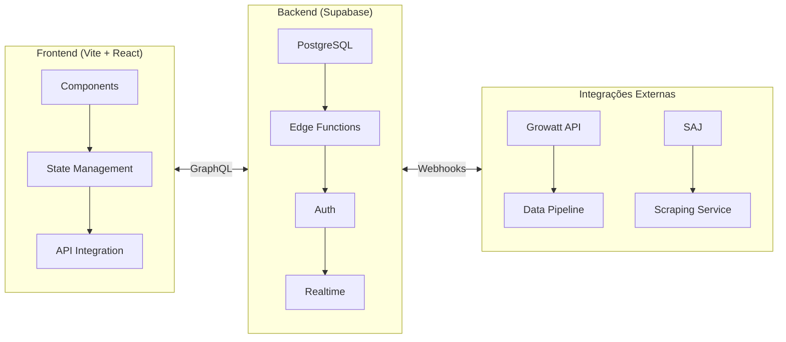
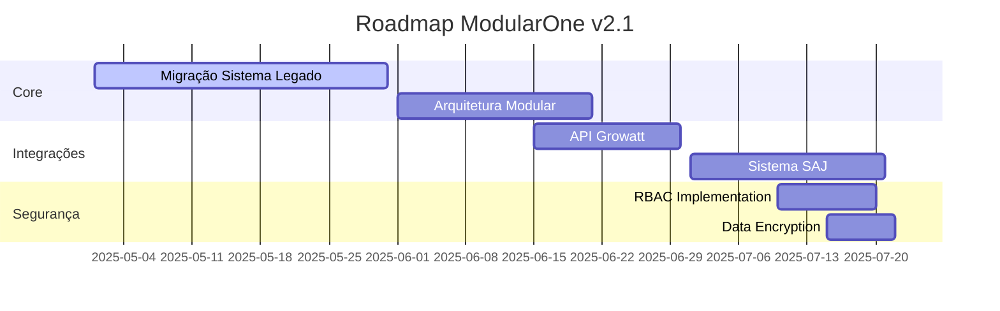
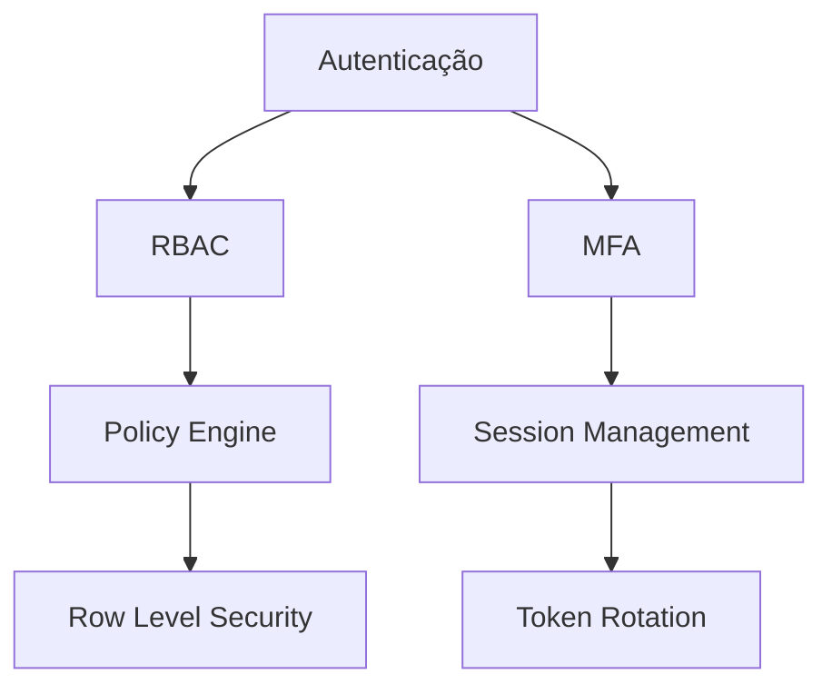
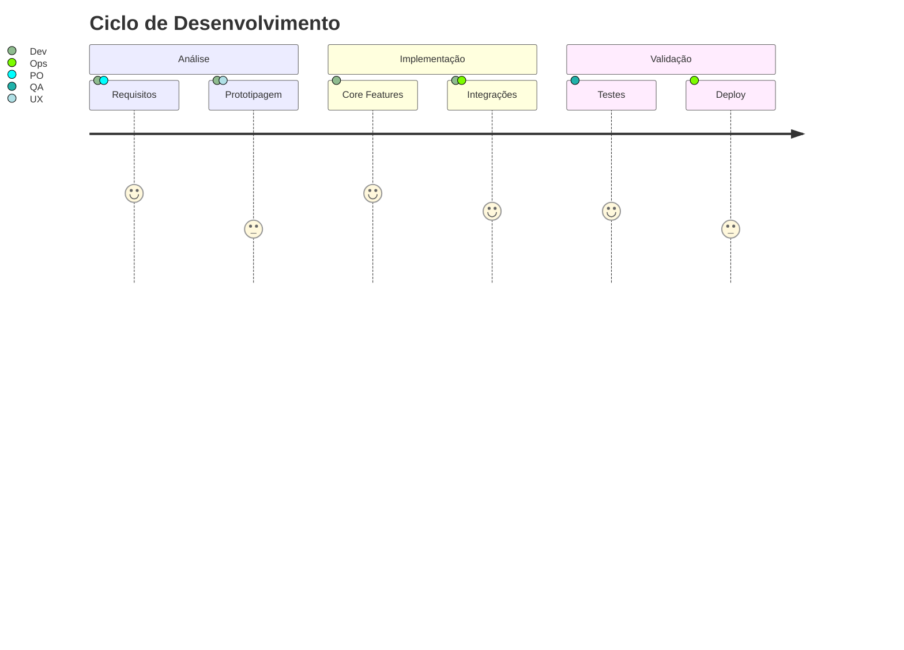
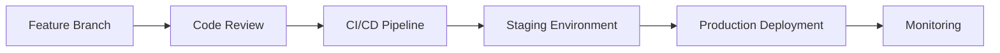
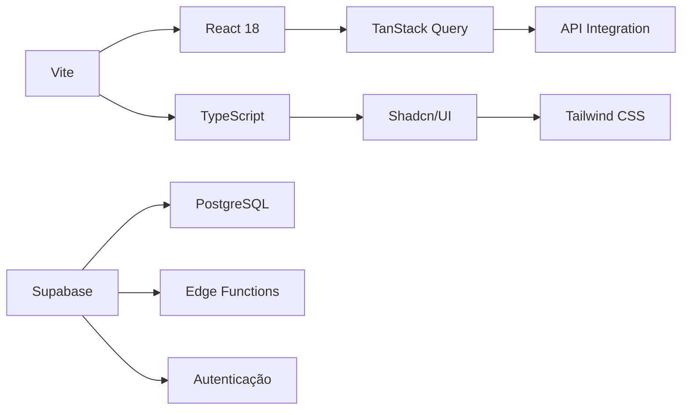
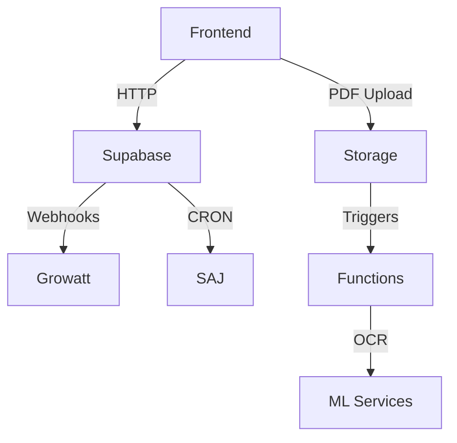
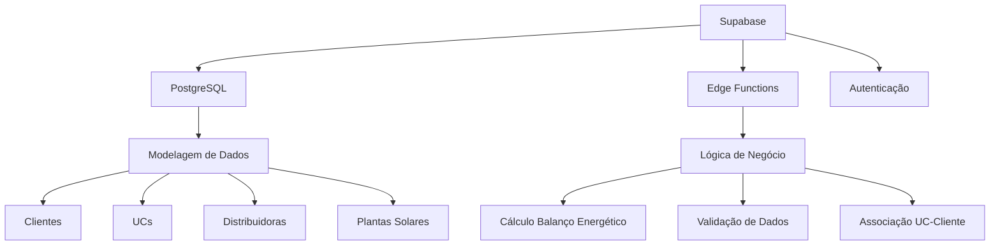

# 🧠 Contexto Arquitetural: ModularOne v2.1

## 🏗 Diagrama de Arquitetura Global


## 🎯 Objetivos Estratégicos


## 📦 Modelagem de Dados Principal
```ts
interface CoreEntities {
  // Modelo de Cliente
  Cliente: {
    id: string;
    tipo: 'PF' | 'PJ';
    ucs: UnidadeConsumidora[];
    contratos: ContratoEnergia[];
  };

  // Modelo de Unidade Consumidora
  UnidadeConsumidora: {
    id: string;
    localizacao: string;
    distribuidora: Distribuidora;
    medicoes: MedicaoEnergia[];
  };
}

// Adicionar nota sobre credenciais de serviço se relevante aqui,
// ou garantir que esteja coberto na seção de Backend/Modelagem de Dados.
// Exemplo: As credenciais para serviços externos como Growatt são gerenciadas
// de forma segura e usam campos padronizados como 'username' e 'password'
// após a recente atualização.
```

## 🔄 Fluxo de Processamento de Dados
```mermaid
sequenceDiagram
  participante Frontend
  participante Supabase
  participante Growatt
  participante SAJ
  
  Frontend->>Supabase: Upload Fatura (PDF)
  Supabase->>Supabase: Extração OCR
  Supabase->>Growatt: Request Dados Geração (com credenciais corretas e hash MD5 da senha)
  Growatt->>Supabase: JSON Data
  Supabase->>SAJ: Request Histórico Consumo
  SAJ->>Supabase: CSV Data
  Supabase->>Supabase: Consolidação Dados
  Supabase->>Frontend: Dashboard Analytics
```

## 🛠 Stack Tecnológica Essencial

### 📚 Dependências Principais
| Categoria       | Tecnologias                          | Versão    |
|-----------------|--------------------------------------|-----------|
| Frontend        | Vite, React, TypeScript              | 4.0+      |
| UI              | Shadcn/UI, Tailwind                  | 3.0+      |
| State Management| TanStack Query, Zod                  | 4.29+     |
| Backend         | Supabase, PostgreSQL                 | 2.0+      |
| Integrações     | Growatt API (com crypto nativo), SAJ Scraper | -   |

### ⚙ Configuração de Ambiente
```ts
interface EnvironmentConfig {
  development: {
    apiEndpoint: string;
    debugMode: boolean;
    mockData: boolean;
  };
  production: {
    apiEndpoint: string;
    performanceMonitoring: boolean;
    errorTracking: boolean;
  };
  testing: {
    integrationTests: boolean;
    e2eTesting: boolean;
  };
}
```

## 🔒 Arquitetura de Segurança

Esta arquitetura é complementada pela implementação de Row Level Security (RLS) em nível de banco de dados PostgreSQL no Supabase. As principais tabelas de dados (como `clientes`, `plantas_solares`, `unidades_consumidoras`, `faturas`, `contratos`, `medicoes_energia`) possuem uma coluna `proprietario_user_id` que vincula cada registro ao usuário autenticado (de `auth.users`) que o criou/gerencia. Políticas de RLS garantem que um usuário só possa realizar operações (SELECT, INSERT, UPDATE, DELETE) nos registros que lhe pertencem (onde `auth.uid() = proprietario_user_id`), assegurando assim o isolamento de dados e a multilocação. A tabela `profiles` armazena dados adicionais do usuário (nome, username, telefone) e também é protegida por RLS.

## 📁 Estrutura de Arquivos Otimizada
```
📦 modularone
├── 📂 public
│   ├── 📄 robots.txt
│   └── 📂 assets
├── 📂 src
│   ├── 📂 core
│   │   ├── 📂 api
│   │   ├── 📂 hooks
│   │   └── 📂 utils
│   ├── 📂 modules
│   │   ├── 📂 solar
│   │   ├── 📂 financeiro
│   │   └── 📂 ia
│   └── 📂 types
├── 📂 supabase
│   ├── 📂 functions
│   │   ├── 📄 get-external-plant-list
│   │   └── 📄 manage-user-integration-credentials 
│   ├── 📂 migrations
│   │   └── 📄 YYYYMMDDHHMMSS_correct_growatt_api_schema.sql
│   └── 📂 scripts
│       └── 📄 test_growatt_integration.ts
│   └── 📂 docs
│       └── 📄 integracao_fabricantes.md
├── 📂 docs
│   ├── 📄 solucao_problema_api_growatt.md
│   └── 📄 guia_implementacao_correcoes_growatt.md
└── 📄 .env (exemplo, não versionado)
```

## 🚀 Estratégia de Implementação


## 📌 Critérios de Aceitação
1. Testes E2E cobrindo 90% dos fluxos críticos
2. Tempo de resposta médio < 1.5s
3. Cobertura de código > 85%
4. Zero vulnerabilidades críticas (OWASP)
5. Documentação técnica completa

## 🔄 Versionamento e Atualizações


### 2.2. Diretório `public/`

Armazena ativos estáticos:

-   `favicon.ico`, `robots.txt` (permissivo).
-   `placeholder.svg`.
-   `lovable-uploads/`: Contém imagens PNG (grandes) com nomes UUID, provavelmente uploads via Lovable.

### 2.3. Diretório `src/`

Contém o código fonte da aplicação React.

-   **`main.tsx`**: Ponto de entrada da aplicação React. Inicializa o React DOM, importa `App.tsx`, `index.css`, e crucialmente `./lib/supabase` para inicializar o cliente Supabase.
-   **`App.tsx`**: Componente raiz do React. Configura provedores globais (`QueryClientProvider`, `AuthProvider` customizado, `TooltipProvider` do Shadcn) e o sistema de rotas com `react-router-dom`. Define rotas para `LandingPage`, páginas de autenticação, e páginas de módulos (`DashboardPage`, `SolarPage`, etc.), muitas delas envolvidas por um `AppShell`.
-   **`index.css`**: Arquivo CSS global principal. Importa fontes (Inter, Nunito Sans), inclui diretivas base do Tailwind. Define um sistema de theming robusto com variáveis CSS para modo claro (landing page) e escuro (app content), alinhado com a marca "ModularOne". Define estilos base, componentes customizados (`.module-card`, `.modular-card`) e utilitários.
-   **`App.css`**: Contém estilos que parecem ser do template inicial do Vite, possivelmente não totalmente utilizados ou sobrescritos.
-   **`vite-env.d.ts`**: Declarações de tipo para Vite (ex: `import.meta.env`) e para importação de ativos (imagens, SVGs como componentes React).

#### 2.3.1. Subdiretórios em `src/`

-   **`lib/`**:
    -   `supabase.ts`: Inicializa e exporta o cliente Supabase usando variáveis de ambiente (`VITE_SUPABASE_URL`, `VITE_SUPABASE_ANON_KEY`).
    -   `utils.ts`: Contém a função utilitária `cn` (combinação de `clsx` e `tailwind-merge`) para classes CSS condicionais e merging.
    -   `imageUtils.ts`: Funções para manipulação de imagens de background (overlays, gradientes).
-   **`hooks/`**: Para hooks customizados do React. `AuthProvider` vem de `@/hooks/useAuth`, indicando um sistema de autenticação próprio.
-   **`components/`**: Para componentes React reutilizáveis.
    -   Esperado um subdiretório `ui/` para componentes Shadcn/UI.
    -   Contém `layout/AppShell.tsx` usado para o layout principal das páginas autenticadas.
-   **`pages/`**: Componentes de página para cada rota da aplicação.
    -   `LandingPage`
    -   Autenticação: `Login`, `Register`, `ResetPassword`
    -   Módulos: `Index` (Dashboard), `Solar`, `Financeiro`, `IA`, `Cadastro`
    -   `Configuracoes`
    -   `NotFound`
-   **`types/`**: Para definições de tipo TypeScript customizadas para a aplicação.

## 🛠 Stack Tecnológica



### 📚 Principais Dependências
```ts
interface TechStack {
  core: {
    build: ['Vite', 'SWC'];
    framework: ['React', 'TypeScript'];
    stateManagement: ['TanStack Query', 'Zod'];
  };
  ui: {
    components: ['Shadcn/UI', 'Lucide Icons'];
    styling: ['Tailwind', 'PostCSS'];
    themes: ['next-themes'];
  };
  backend: {
    database: ['Supabase', 'PostgreSQL'];
    auth: ['Supabase Auth'];
    storage: ['Supabase Storage'];
  };
  utils: {
    form: ['React Hook Form', 'Zod'];
    date: ['date-fns'];
    notifications: ['Sonner'];
  };
}
```

### 🔗 Diagrama de Integrações


## 4. Theming e UI (Atual)

-   **Modo Claro e Escuro**: Implementado via CSS variables.
-   **Branding "ModularOne"**: Cores e componentes customizados.
-   **Temas por Módulo**: Paletas de cores (`solar`, `finance`, `ai`).

## 5. Geração e Ferramentas Auxiliares (Atual)

-   **Lovable**: Plataforma para gerar/gerenciar o projeto.
-   **GPT Engineer**: Script `gptengineer.js` incluído.

## 6. Pontos Pendentes de Análise Detalhada (Estrutura Atual)

-   Conteúdo específico de `src/hooks/` (especialmente `useAuth.tsx`).
-   Estrutura interna e componentes dentro de `src/components/` (incluindo `ui/` e `layout/AppShell.tsx`).
-   Implementação detalhada das páginas em `src/pages/`.
-   Definições de tipo em `src/types/`.
-   Conteúdo do `.env` (não acessível, mas crucial para Supabase e outras integrações).

## 🚧 Funcionalidades Pendentes

### 🔧 Arquitetura do Backend


### 📦 Modelagem de Dados
```ts
interface DatabaseSchema {
  // Tabela de Perfis de Usuário (complementa auth.users)
  profiles: {
    id: 'UUID PRIMARY KEY REFERENCES auth.users(id) ON DELETE CASCADE'; // Chave estrangeira para auth.users
    nome: 'TEXT';
    username: 'TEXT UNIQUE'; // Nome de usuário público e único
    telefone: 'TEXT NOT NULL'; // Obrigatório para interações e lembretes
    // Os timestamps created_at e updated_at são gerenciados pelo Supabase/PostgreSQL
    // created_at: 'TIMESTAMPTZ DEFAULT now()'; 
    // updated_at: 'TIMESTAMPTZ DEFAULT now()';
  };

  clientes: {
    id: 'UUID PRIMARY KEY'; // Usar DEFAULT gen_random_uuid() na criação da tabela
    proprietario_user_id: 'UUID REFERENCES auth.users(id) ON DELETE CASCADE'; // Dono do registro
    tipo: ''PF' | 'PJ'';
    dados_cadastrais: 'JSONB'; // Informações como CPF/CNPJ, endereço, etc.
    // A relação com contratos e UCs é feita por chaves estrangeiras nessas tabelas
    // contratos: object[]; // Removido, usar tabela 'contratos'
    // ucs: object[]; // Removido, usar tabela 'unidades_consumidoras'
  };
  
  distribuidoras: { // Tabela global, não precisa de proprietario_user_id
    id: 'UUID PRIMARY KEY';
    nome: 'TEXT NOT NULL UNIQUE';
    // outras informações relevantes da distribuidora
  };

  plantas_solares: { // Renomeado de plantassolares
    id: 'UUID PRIMARY KEY';
    proprietario_user_id: 'UUID REFERENCES auth.users(id) ON DELETE CASCADE';
    id_growatt: 'TEXT UNIQUE'; // ID da planta no sistema Growatt, se aplicável
    potencia_instalada_kwp: 'NUMERIC'; // Potência da planta
    // ultima_atualizacao: Date; // Pode ser gerenciado por triggers ou lógica de app
  };

  unidades_consumidoras: {
    id: 'UUID PRIMARY KEY';
    proprietario_user_id: 'UUID REFERENCES auth.users(id) ON DELETE CASCADE'; // Dono do registro
    cliente_id: 'UUID REFERENCES clientes(id) ON DELETE CASCADE'; // Cliente ao qual a UC pertence
    localizacao: 'TEXT'; // Endereço completo ou coordenadas
    distribuidora_id: 'UUID REFERENCES distribuidoras(id)';
    tipo: ''Geradora' | 'Consumidora Remota' | 'Consumidora Local''; // Adicionado 'Consumidora Local'
    fonte_dados: ''SAJ' | 'Growatt' | 'Manual' | 'Outra''; // Adicionado 'Manual'
    planta_solar_id?: 'UUID REFERENCES plantas_solares(id) ON DELETE SET NULL'; // Opcional, se for uma UC geradora com planta mapeada
  };
  
  contratos: { // Nova tabela
    id: 'UUID PRIMARY KEY';
    proprietario_user_id: 'UUID REFERENCES auth.users(id) ON DELETE CASCADE';
    cliente_id: 'UUID REFERENCES clientes(id) ON DELETE CASCADE';
    numero_contrato: 'TEXT UNIQUE';
    data_inicio: 'DATE';
    data_fim: 'DATE';
    detalhes_tarifarios: 'JSONB'; // Estrutura das tarifas, postos, etc.
    status: ''Ativo' | 'Inativo' | 'Pendente'';
  };

  faturas: {
    id: 'UUID PRIMARY KEY';
    proprietario_user_id: 'UUID REFERENCES auth.users(id) ON DELETE CASCADE';
    unidade_consumidora_id: 'UUID REFERENCES unidades_consumidoras(id) ON DELETE CASCADE';
    mes_referencia: 'DATE NOT NULL'; // Mês/Ano da fatura
    data_emissao: 'DATE';
    data_vencimento: 'DATE';
    arquivo_url: 'TEXT'; // URL para o PDF/imagem da fatura no Supabase Storage
    dados_processados: 'JSONB'; // { info_gerais, info_financeiro, info_medidor, consumo_kwh, injetado_kwh, etc. }
    status: ''Processado' | 'Pendente' | 'Erro no Processamento' | 'Agendado'';
  };

  medicoes_energia: { // Nova tabela
    id: 'UUID PRIMARY KEY';
    proprietario_user_id: 'UUID REFERENCES auth.users(id) ON DELETE CASCADE';
    unidade_consumidora_id: 'UUID REFERENCES unidades_consumidoras(id) ON DELETE CASCADE';
    data_medicao: 'TIMESTAMPTZ NOT NULL';
    valor_medido_kwh: 'NUMERIC NOT NULL';
    tipo_medicao: ''Consumo Ponta' | 'Consumo Fora Ponta' | 'Injetado Ponta' | 'Injetado Fora Ponta' | 'Saldo Anterior''; // Detalhar os tipos
    origem_dado: ''Fatura' | 'Sensor Growatt' | 'Sensor SAJ' | 'Manual'';
    // UNIQUE (unidade_consumidora_id, data_medicao, tipo_medicao) para evitar duplicidade
  };

  // Atualizar ou adicionar detalhes sobre 'credenciais_servico_usuario' e 'fabricantes_equipamentos'/'fabricantes_api'
  // Exemplo para credenciais_servico_usuario:
  credenciais_servico_usuario: {
    id: 'UUID PRIMARY KEY';
    proprietario_user_id: 'UUID REFERENCES auth.users(id)';
    fabricante_id: 'UUID REFERENCES fabricantes_equipamentos(id)'; // ou fabricantes_api(id)
    credenciais_criptografadas: 'TEXT'; // Contém JSON com 'username', 'password' (Growatt)
    // IV (Initialization Vector) para descriptografia, se aplicável
    iv: 'TEXT';
    // ... outros campos ...
  };

  fabricantes_equipamentos: { // ou fabricantes_api
    id: 'UUID PRIMARY KEY';
    nome: 'TEXT NOT NULL UNIQUE'; // Ex: "Growatt"
    api_config_schema: 'JSONB'; // Define a estrutura esperada para as credenciais. 
                                // Para Growatt: { "type": "object", "properties": { "username": { "type": "string" }, "password": { "type": "string" } }, "required": ["username", "password"] }
    // ... outros campos ...
  };
}
```

### 🔄 Fluxo de Processamento
```mermaid
sequenceDiagram
  participante Frontend
  participante Supabase
  participante Growatt
  Frontend->>Supabase: Solicita lista de plantas externas (e.g., Growatt)
  Supabase->>Supabase: Edge Function (get-external-plant-list)
  Supabase->>Supabase: Recupera e descriptografa credenciais (username, password)
  Supabase->>Supabase: Gera hash MD5 da senha (usando crypto.subtle.digest)
  Supabase->>Growatt: Chama API com usuário e hash da senha
  Growatt->>Supabase: Retorna dados das plantas
  Supabase->>Frontend: Envia lista de plantas
```

### 7.2. Integrações com Sistemas Externos

-   **API Growatt:**
    -   Cliente API seguro implementado como Supabase Edge Function (`get-external-plant-list`, `manage-user-integration-credentials`).
    -   Autenticação corrigida: utiliza campos `username` e `password` (descriptografados do DB) e envia `username` junto com o hash MD5 da senha (calculado via API `crypto.subtle.digest` nativa).
    -   Função `get-external-plant-list` busca a lista de plantas.
    -   Função `manage-user-integration-credentials` valida as credenciais com a API Growatt.
    -   Tratamento de erros e logging aprimorados, especialmente para o erro `10011 (error_permission_denied)`.
    -   Migração de schema (`YYYYMMDDHHMMSS_correct_growatt_api_schema.sql`) aplicada para padronizar nomes de campos de credenciais.
-   **Coleta de Dados SAJ:**
    -   **Reavaliar abordagem:** Selenium (usado no sistema antigo) não é ideal para uma arquitetura baseada em Supabase Functions.
    -   Considerar alternativas:
        -   API oficial do SAJ (se disponível).
        -   Serviço de scraping dedicado (executado separadamente e enviando dados para o Supabase).
        -   Upload manual de relatórios SAJ e processamento via Supabase Function.
-   **Outras APIs (Potenciais):** Previsão do tempo, APIs de distribuidoras (se disponíveis).

### 7.3. Processamento Avançado de Faturas

-   **Mecanismo de Upload de Faturas PDF (Frontend + Supabase Storage).**
-   **Serviço de Processamento de Faturas (Supabase Function ou serviço externo):**
    -   **OCR (Reconhecimento Óptico de Caracteres):** Para converter PDF em texto.
    -   **Parsing Inteligente:** Lógica para identificar e extrair dados de diferentes layouts de fatura.
    -   **Extração Estruturada:** Popular os modelos de dados de fatura no Supabase com os múltiplos campos relevantes.
    -   **Validação de Dados Extraídos.**
    -   **Armazenamento no Supabase.**
    -   Capacidade de lidar com erros e reprocessamento.

### 7.4. Tarefas Agendadas e Assíncronas

-   **Utilizar Supabase Scheduled Functions para:**
    -   Atualização periódica de dados da API Growatt (status e histórico).
    -   Coleta de dados SAJ (se a abordagem permitir automação).
    -   Outras tarefas de manutenção ou agregação de dados.
-   **Considerar filas (se necessário para tarefas longas ou de alto volume):** Supabase não tem um serviço de fila nativo como Celery/Redis. Para tarefas muito complexas, pode ser necessário um serviço externo ou uma arquitetura de functions que simule uma fila.

### 7.5. Módulo Solar (Frontend e Lógica Associada)

-   **Página `SolarPage` e componentes relacionados:**
    -   Visualização de dados de Plantas Solares (Growatt) e Inversores SAJ.
    -   Dashboards de geração (atual, diária, mensal, anual).
    -   Gráficos interativos (usando `recharts`).
    -   Filtros avançados (por período, por planta/UC).
    -   Exportação de dados de geração para CSV.
-   **Página `CadastroPage` (ou seções dentro de outras páginas):**
    -   CRUD para Clientes, Unidades Consumidoras, Plantas Solares (Growatt - parcialmente via API), Distribuidoras.
-   **Exibição e Análise de Faturas Processadas:**
    -   Listagem de faturas.
    -   Visualização detalhada dos dados extraídos de cada fatura.
-   **Análise Comparativa:**
    -   Comparar geração (Growatt/SAJ) com dados da fatura.
-   **Balanço Energético:**
    -   Cálculo e visualização do balanço energético por UC e período.

### 7.6. Módulo Financeiro (Frontend e Lógica Associada)

-   **Página `FinanceiroPage` e componentes:**
    -   Visualização de dados financeiros extraídos das faturas.
    -   Relatórios de custos, créditos de energia, impostos.
    -   Análise de economia e performance financeira.
    -   Filtros por período, UC, cliente.

### 7.7. Módulo IA (Frontend e Lógica Associada)

-   **Página `IAPage` e componentes:**
    -   **Definir escopo e funcionalidades:**
        -   Pode incluir: Assistência na validação de dados de faturas extraídos.
        -   Detecção de anomalias na geração ou consumo.
        -   Previsão de geração solar (usando histórico e possivelmente dados meteorológicos).
        -   Otimização de consumo ou tarifação.
    -   Implementar modelos de IA (podem ser Supabase Functions com bibliotecas Python/JS ou integração com serviços de IA externos).
    -   Visualização dos insights e resultados da IA.

### 7.8. Melhorias de UX/UI e Funcionalidades Gerais

-   **Sistema de Notificações (Sonner/Toaster):**
    -   Alertas para falhas de integração, status de processamento, queda de geração, etc.
-   **Responsividade e Acessibilidade.**
-   **Segurança:**
    -   Gerenciamento seguro de chaves de API (Supabase secrets).
    -   Políticas de acesso e RLS (Row Level Security) no Supabase.
-   **Escalabilidade:**
    -   Otimização de queries no Supabase.
    -   Design eficiente de Supabase Functions.
    -   Considerar limites da plataforma Supabase e planejar para crescimento.
-   **Manutenibilidade:**
    -   Código bem documentado e organizado.
    -   Testes unitários e de integração (especialmente para Supabase Functions).
    -   Adicionado script de teste para integração com Growatt: `supabase/scripts/test_growatt_integration.ts`.

Este roteiro expandido deve fornecer uma base sólida para o desenvolvimento incremental do projeto ModularOne, combinando a interface moderna já estruturada com as funcionalidades robustas do sistema legado.
