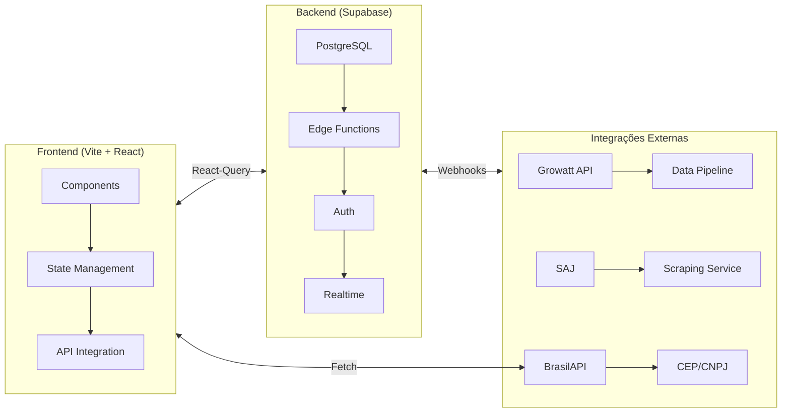
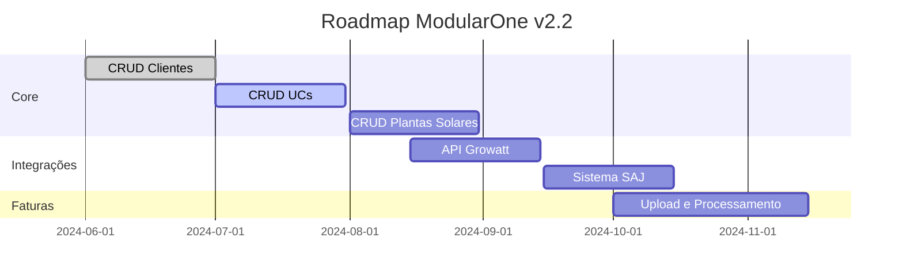
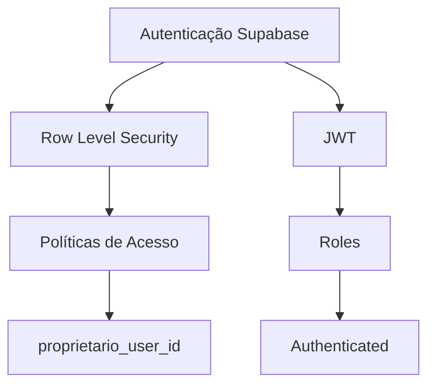
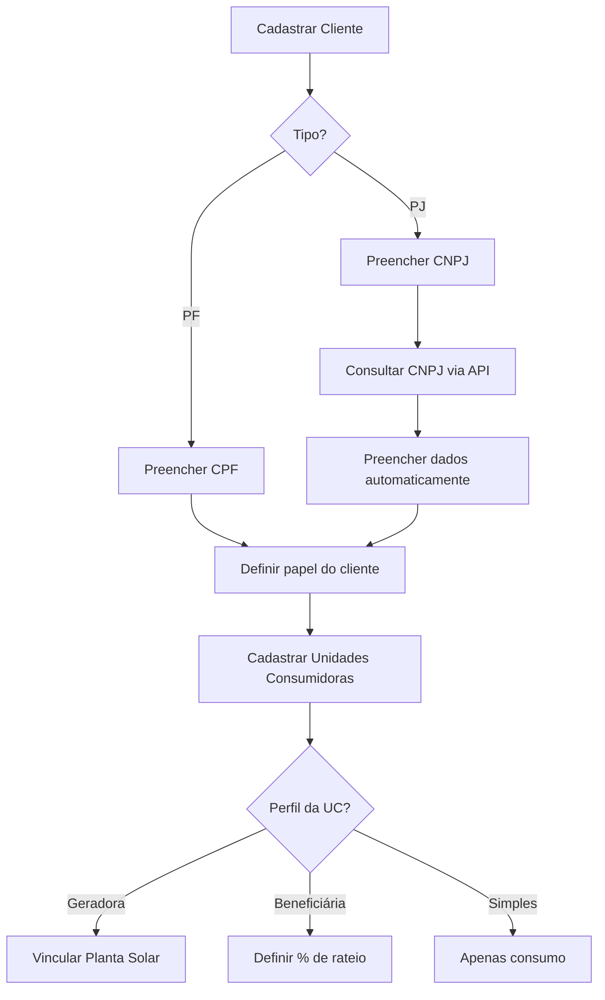
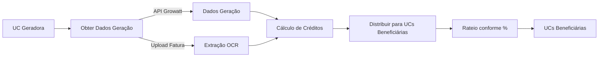

# 🧠 Contexto Arquitetural: ModularOne v2.2

## 🏗 Diagrama de Arquitetura Global


## 🎯 Objetivos Estratégicos


## 📦 Modelagem de Dados Principal
```ts
interface CoreEntities {
  // Modelo de Cliente
  Cliente: {
    id: string;
    proprietario_user_id: string; // ID do usuário proprietário do registro (RLS)
    tipo: 'PF' | 'PJ';
    nome_razao_social: string;
    cpf_cnpj: string;
    email: string;
    telefone_principal: string;
    tipo_cliente: 'PROPRIETARIO_USINA' | 'CONSUMIDOR_BENEFICIARIO' | 'EMPRESA_PARCEIRA' | 'OUTRO';
    // Campos de endereço
    cep: string;
    logradouro: string;
    numero_endereco: string;
    complemento: string;
    bairro: string;
    cidade: string;
    estado: string;
    // Campos adicionais para PJ
    nome_fantasia?: string;
    inscricao_estadual?: string;
    situacao_cadastral?: string;
    // Dados JSON para compatibilidade e campos adicionais
    dados_adicionais?: Record<string, any>;
  };

  // Modelo de Unidade Consumidora
  UnidadeConsumidora: {
    id: string;
    proprietario_user_id: string;
    cliente_id: string;
    distribuidora_id: string;
    numero_uc: string;
    nome_identificador_uc: string;
    perfil_uc: 'GERADORA_PRINCIPAL' | 'CONSUMIDORA_BENEFICIARIA' | 'CONSUMIDORA_SIMPLES';
    status_uc: 'ATIVA' | 'INATIVA' | 'PENDENTE';
    // Campos de endereço
    endereco_cep: string;
    endereco_logradouro: string;
    endereco_numero: string;
    endereco_complemento?: string;
    endereco_bairro: string;
    endereco_cidade: string;
    endereco_estado: string;
    // Campos técnicos da UC
    grupo_tarifario?: string;
    subgrupo_tarifario?: string;
    modalidade_tarifaria?: string;
    classe_consumo?: string;
    subclasse_consumo?: string;
    tensao_nominal_v?: number;
    numero_medidor?: string;
    data_conexao?: Date;
    // Relações
    planta_solar_id?: string; // Para UCs geradoras
    unidade_geradora_id?: string; // Para UCs beneficiárias (relacionamento com outra UC)
    fonte_dados_geracao?: 'MANUAL' | 'API_GROWATT' | 'API_SAJ';
    // Dados de contrato (para beneficiárias)
    percentual_rateio?: number;
    ordem_prioridade_rateio?: number;
    data_inicio_beneficio?: Date;
    data_fim_beneficio?: Date;
    // Dados adicionais em formato JSON
    dados_adicionais_uc?: Record<string, any>;
  };

  // Planta Solar
  PlantaSolar: {
    id: string;
    proprietario_user_id: string;
    nome_planta: string;
    potencia_instalada_kwp: number;
    id_growatt?: string; // ID da planta no sistema Growatt, se aplicável
    cliente_id: string; // Cliente proprietário da planta
    // Outras informações técnicas...
  };

  // Distribuidora de Energia
  Distribuidora: {
    id: string;
    nome: string;
    // Outras informações relevantes da distribuidora
  };
}

// Modelo de integração com fabricantes
interface IntegrationEntities {
  // Fabricantes de equipamentos
  FabricanteEquipamento: {
    id: string;
    nome: string;
    descricao?: string;
    suporta_api_dados: boolean;
    api_config_schema?: Record<string, any>; // Schema JSON para configuração da API
    user_id: string; // Usuário que criou o registro
  };

  // Credenciais de serviço do usuário
  CredencialServicoUsuario: {
    id: string;
    user_id: string; // Proprietário das credenciais
    fabricante_id: string; // ID do fabricante
    credenciais_seguras: Record<string, any>; // Objeto JSON com credenciais (username, password)
    nome_referencia?: string;
    status_validacao: 'PENDENTE' | 'VALIDO' | 'INVALIDO';
    ultima_validacao_em?: Date;
  };
}
```

## 🔄 Fluxo de Processamento de Dados
```mermaid
sequenceDiagram
  participante Frontend
  participante Supabase
  participante BrasilAPI
  participante Growatt
  
  Frontend->>BrasilAPI: Consulta CNPJ/CEP
  BrasilAPI->>Frontend: Retorna dados do cliente
  Frontend->>Supabase: Salva cliente (Tabela clientes)
  Frontend->>Supabase: Cria UC (Tabela unidades_consumidoras)
  Frontend->>Supabase: Configura credenciais (Tabela credenciais_servico_usuario)
  Supabase->>Growatt: Request Dados Geração (Autenticação com MD5)
  Growatt->>Supabase: JSON Data
  Supabase->>Frontend: Dashboard Analytics
```

## 🛠 Stack Tecnológica Essencial

### 📚 Dependências Principais
| Categoria       | Tecnologias                          | Versão    |
|-----------------|--------------------------------------|-----------|
| Frontend        | Vite, React, TypeScript              | 4.0+      |
| UI              | Shadcn/UI, Tailwind, Lucide Icons    | 3.0+      |
| State Management| TanStack Query, React Hook Form, Zod | 4.29+     |
| Backend         | Supabase, PostgreSQL                 | 2.0+      |
| Integrações     | Growatt API, BrasilAPI               | -         |

### ⚙ Configuração de Ambiente
```ts
interface EnvironmentConfig {
  development: {
    apiEndpoint: string; // URL do Supabase
    anon_key: string;    // Chave anônima do Supabase
    debugMode: boolean;
  };
  production: {
    apiEndpoint: string;
    anon_key: string;
    performanceMonitoring: boolean;
    errorTracking: boolean;
  };
  testing: {
    integrationTests: boolean;
    e2eTesting: boolean;
  };
}
```

## 🔒 Arquitetura de Segurança


## 📁 Estrutura de Arquivos Otimizada
```
📦 modularone
├── 📂 public
│   ├── 📄 assets
├── 📂 src
│   ├── 📂 components
│   │   ├── 📂 ui
│   │   └── 📂 layout
│   ├── 📂 contexts
│   │   └── 📄 AuthContext.tsx
│   ├── 📂 hooks
│   │   ├── 📄 use-toast.ts
│   │   └── 📄 use-form.ts
│   ├── 📂 lib
│   │   ├── 📄 supabase.ts
│   │   └── 📄 utils.ts
│   ├── 📂 pages
│   │   ├── 📂 auth
│   │   ├── 📂 clientes
│   │   │   ├── 📄 ClienteForm.tsx
│   │   │   ├── 📄 ClientesList.tsx
│   │   │   └── 📄 ClienteDetails.tsx
│   │   ├── 📂 ucs
│   │   │   ├── 📄 UCForm.tsx
│   │   │   ├── 📄 UCsList.tsx
│   │   │   └── 📄 UCDetails.tsx
│   │   ├── 📂 plantas_solares
│   │   │   └── 📄 PlantasList.tsx
│   │   ├── 📂 dashboard
│   │   │   └── 📄 Index.tsx
│   │   └── 📂 settings
│   ├── 📂 supabase
│   │   └── 📂 functions
│   │       └── 📄 criar-unidade-consumidora
│   ├── 📂 types
│   ├── 📂 utils
│   ├── 📄 App.tsx
│   ├── 📄 main.tsx
│   ├── 📄 routes.tsx
│   └── 📄 index.css
├── 📂 supabase
│   ├── 📂 functions
│   │   ├── 📄 get-external-plant-list
│   │   └── 📄 manage-user-integration-credentials
│   ├── 📂 migrations
│   │   ├── 📄 01_create_integration_tables.sql
│   │   └── 📄 02_correct_growatt_api_schema.sql
├── 📄 proximo_passo.txt
└── 📄 package.json
```

## 🚧 Estado Atual de Implementação

### ✅ Concluído
1. **Clientes:**
   - CRUD completo (criar, listar, editar, excluir)
   - Interface visual finalizada com tabela, filtros, ações
   - Integração com BrasilAPI para consulta de CNPJ e CEP
   - Gestão do papel do cliente (tipo_cliente)

2. **Modelagem de Dados:**
   - Tabelas: `clientes`, `distribuidoras`, `fabricantes_equipamentos`, `credenciais_servico_usuario`
   - Estrutura para `unidades_consumidoras` e `plantas_solares`
   - RLS aplicado para segurança por usuário proprietário
   
3. **Integrações:**
   - Correção da estrutura para integração com Growatt
   - Implementação de consultas a BrasilAPI (CEP e CNPJ)

### 🏗️ Em Desenvolvimento
1. **Unidades Consumidoras:**
   - Formulário de criação/edição implementado
   - Listagem e visualização em desenvolvimento
   - Integração com distribuidoras e plantas solares
   - Gestão de perfis (geradora, consumidora, beneficiária)

2. **Plantas Solares:**
   - Estrutura de dados definida
   - Interface visual básica em desenvolvimento

### 📆 Próximos Passos
1. **Processamento de Faturas:**
   - Upload e armazenamento de PDFs
   - Extração de dados por OCR
   - Armazenamento estruturado
   
2. **Integrações com APIs Externas:**
   - Implementação completa com Growatt
   - Integração com SAJ

3. **Dashboard Analítico:**
   - Visualização de consumo/geração
   - Relatórios e gráficos
   - Balanço energético

## 🔄 Fluxos de Negócio Principais

### 📋 Fluxo de Cadastro de Cliente e UCs


### 💡 Fluxo de Geração e Distribuição


## 🛡️ Políticas de Segurança

O sistema implementa Row Level Security (RLS) no Supabase:

1. **Isolamento de Dados:**
   - Cada registro tem campo `proprietario_user_id` vinculado ao usuário autenticado
   - Políticas garantem que usuários só acessem seus próprios dados

2. **Políticas Implementadas:**
   - SELECT: `auth.uid() = proprietario_user_id`
   - INSERT: Injeção automática de `auth.uid()` como proprietário
   - UPDATE/DELETE: `auth.uid() = proprietario_user_id`

3. **Autenticação:**
   - Login via e-mail/senha
   - Tokens JWT gerenciados pelo Supabase

## 📊 Estratégia de Dados

1. **Migração Progressiva:**
   - Campo `dados_adicionais` JSON para compatibilidade 
   - Movendo dados gradualmente para colunas dedicadas
   - Priorização de dados em colunas próprias, fallback para JSON

2. **Validação:**
   - Uso de Zod para validação de formulários
   - Validação em banco via CHECK constraints

3. **Transações:**
   - Integridade referencial via FOREIGN KEY
   - Transações em operações complexas