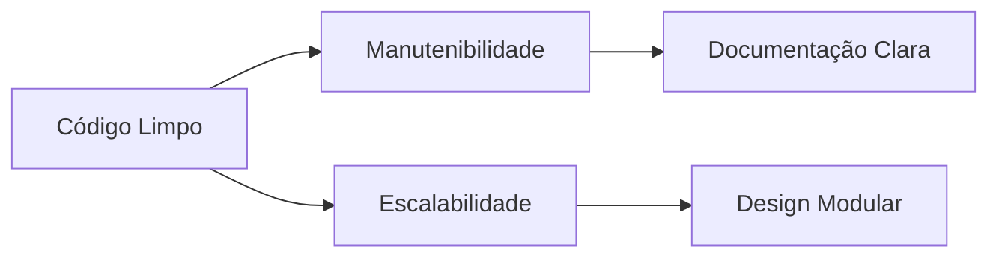

---
description: Diretrizes Técnicas para Desenvolvimento Modular
globs: 
alwaysApply: true
version: 2.1
# 🧠 Arquitetura do Projeto

## 🎯 Objetivo Estratégico


## 📌 Princípios Técnicos

### 🔄 Modularidade
```ts
// Estrutura de módulo padrão
interface Modulo {
  nome: string;
  responsabilidade: string;
  interface: string[];
  dependencias: Modulo[];
}
```

### 📏 Métricas de Qualidade
| Métrica            | Aceitável   | Ideal      |
|---------------------|-------------|------------|
| Complexidade Ciclomática | ≤15       | ≤10        |
| Acoplamento         | Baixo       | Mínimo     |
| Coesão              | Alta        | Máxima     |
| Linhas por Arquivo  | ≤300        | ≤150       |

## 🛠️ Padrões de Implementação

### 📚 Boas Práticas
```ts
// Exemplo de função bem documentada
/**
 * Calcula consumo energético mensal
 * @param leituras Array de medições diárias (kWh)
 * @returns Objeto com total e média diária
 */
function calcularConsumo(leituras: number[]) {
  // Implementação...
}
```

### 🔍 Fluxo de Debugging
```mermaid
sequenceDiagram
  participante Dev
  participante Sistema
  participante API Externa
  Dev->>Sistema: Identifica erro (e.g., em Edge Function)
  Sistema->>Dev: Logs detalhados (incluindo interações com API Externa)
  Dev->>Sistema: Adiciona instrumentação / Executa Script de Teste de Integração (e.g., test_growatt_integration.ts)
  Sistema->>API Externa: Script de Teste interage
  API Externa->>Sistema: Resposta do Script
  Sistema->>Dev: Dados de execução / Resposta da API Externa
  Dev->>Sistema: Implementa correção na Edge Function
  Dev->>Sistema: Reimplanta Edge Function e Testa Novamente
```

Adicionalmente, para integrações complexas como a da Growatt, é crucial:
- Analisar os logs da Supabase Function para capturar a requisição exata enviada e a resposta recebida.
- Utilizar scripts de teste dedicados (`supabase/scripts/test_growatt_integration.ts`) para isolar e reproduzir o comportamento da API externa.

## 🤖 Integração com IA

### Workflow de Validação
1. Geração de código pela IA (se aplicável)
2. Análise estática (ESLint/TypeScript)
3. Revisão de padrões arquiteturais
4. Testes unitários e de integração automatizados (incluindo scripts como `test_growatt_integration.ts` para APIs externas)
5. Aprovação manual final

## 🔄 Ciclo de Vida do Código
```mermaid
graph TD
  A[Planejamento] --> B[Implementação]
  B --> C[Revisão]
  C --> D[Testes]
  D[Testes (Unitários, Integração, E2E, incluindo scripts de validação de API)] --> E[Documentação]
  E --> F[Deploy]
  F[Deploy (Frontend, Edge Functions via 'supabase functions deploy', Migrações DB via 'supabase db push')] --> G[Monitoramento]
  G --> A
```

## ✅ Checklist de Code Review
- [ ] Atende aos padrões de estilo
- [ ] Passa em todos os testes (unitários, integração, E2E relevantes)
- [ ] Documentação atualizada (código, APIs, guias de solução, scripts de teste)
- [ ] Métricas de qualidade dentro dos limites
- [ ] Compatibilidade cross-ambiente

## 🚀 Estratégia de Deploy
| Ambiente | Pipeline               | Validações Obrigatórias       | Detalhes de Deploy Supabase |
|----------|------------------------|-------------------------------|-----------------------------|
| Dev      | CI Básico              | Linting, Testes Unitários     | `supabase functions deploy <func>`, `supabase db push` (após `db pull`) |
| Test     | CI Completo            | Testes de Integração, E2E     | Deploy completo de functions e migrações sequenciais |
| Prod     | CD com Approvals       | Security Scan, Load Testing   | Deploy controlado e monitorado de functions e migrações |

## 📊 Monitoramento Pós-Deploy
```ts
interface MetricasProd {
  uptime: number;
  latency: number;
  errorRate: number;
  resourceUsage: {
    cpu: number;
    memory: number;
  };
}
```

## 📚 Política de Documentação
1. Docstrings em todas as funções e classes públicas.
2. README por módulo e para componentes complexos ou serviços (e.g., `supabase/docs/integracao_fabricantes.md`).
3. Diagramas de arquitetura atualizados (global, por módulo, sequência de fluxos críticos).
4. Guias de estilo específicos por tecnologia.
5. Registro de decisões arquiteturais (ADR).
6. Documentação para scripts de teste e utilitários importantes (explicando seu propósito e como usá-los).
7. Guias de solução de problemas para erros comuns ou integrações complexas (e.g., `docs/solucao_problema_api_growatt.md`, `docs/guia_implementacao_correcoes_growatt.md`).

5. Registro de decisões arquiteturais (ADR)
