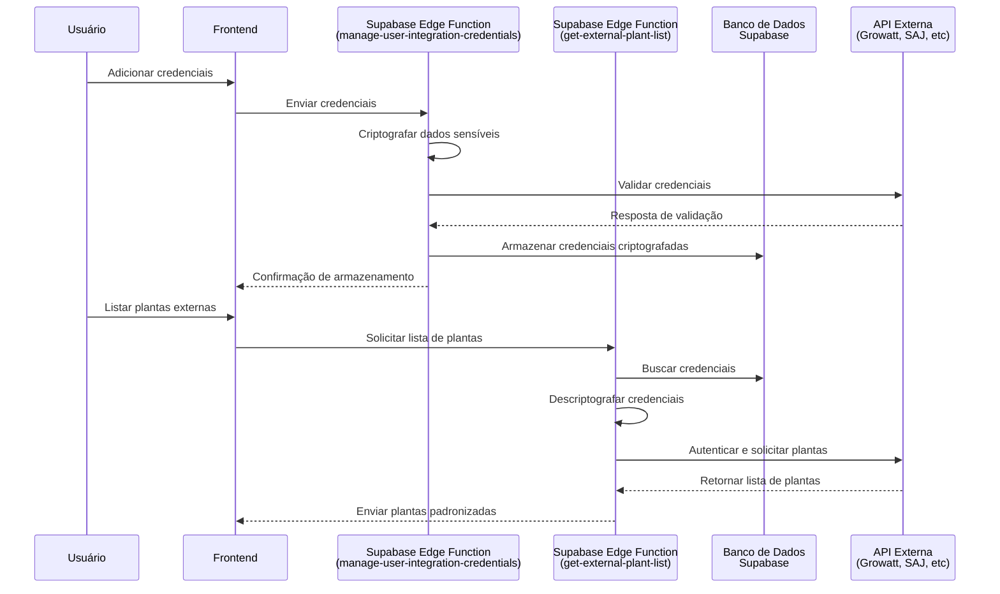

# Arquitetura de Integração com APIs de Fabricantes

Este documento descreve a arquitetura e o fluxo de integração com APIs de fabricantes de equipamentos solares no ModularOne.

## Visão Geral

A integração com APIs de fabricantes permite que o ModularOne se conecte a sistemas externos para obter dados de plantas solares, como a Growatt, SAJ, entre outros. A arquitetura foi projetada para ser segura e extensível.



## Componentes Principais

### 1. Schema de Tabelas

- **fabricantes_equipamentos**: Armazena informações sobre fabricantes suportados
  - `id`: UUID do fabricante
  - `nome`: Nome do fabricante (ex: Growatt, SAJ)
  - `descricao`: Descrição do fabricante
  - `suporta_api_dados`: Booleano indicando se o fabricante suporta API
  - `api_config_schema`: Objeto JSON que define os campos necessários para configuração da API
  - Outros campos: `user_id`, `created_at`, `updated_at`

- **credenciais_servico_usuario**: Armazena credenciais criptografadas do usuário
  - `id`: UUID da credencial
  - `user_id`: ID do usuário proprietário
  - `fabricante_id`: ID do fabricante (ref. fabricantes_equipamentos)
  - `credenciais_seguras`: Objeto JSON com credenciais criptografadas
  - `nome_referencia`: Nome amigável para a credencial
  - `status_validacao`: Status da validação ("VALIDO", "INVALIDO", "PENDENTE")
  - Outros campos: `ultima_validacao_em`, `created_at`, `updated_at`

### 2. Edge Functions

- **manage-user-integration-credentials**: Gerencia o ciclo de vida das credenciais
  - Criação, leitura, atualização e exclusão de credenciais
  - Criptografia de dados sensíveis
  - Validação das credenciais com a API do fabricante

- **get-external-plant-list**: Obtém lista de plantas da API do fabricante
  - Descriptografa credenciais armazenadas
  - Conecta-se à API específica do fabricante
  - Padroniza os dados retornados para um formato comum

### 3. Módulo de Criptografia (_shared/crypto.ts)

Responsável por criptografar e descriptografar dados sensíveis usando AES-GCM.

```typescript
// Exemplos de funções disponíveis
async function getCryptoKey(): Promise<CryptoKey>; 
async function encryptValue(value: string, cryptoKey: CryptoKey): Promise<{ iv_hex: string; ciphertext_hex: string }>;
async function decryptValue(iv_hex: string, ciphertext_hex: string, cryptoKey: CryptoKey): Promise<string>;
```

## Configuração de Novos Fabricantes

Para adicionar suporte a um novo fabricante de equipamentos com API:

1. **Adicione o fabricante na tabela**:

```sql
INSERT INTO fabricantes_equipamentos (nome, descricao, suporta_api_dados, api_config_schema, user_id)
VALUES (
  'Novo Fabricante',
  'Descrição do novo fabricante',
  TRUE,
  '{
    "fields": [
      { "name": "username", "label": "Nome de Usuário", "type": "text", "required": true },
      { "name": "password", "label": "Senha", "type": "password", "required": true, "encrypt": true },
      { "name": "api_key", "label": "Chave da API (opcional)", "type": "text", "required": false, "encrypt": true }
    ]
  }',
  '00000000-0000-0000-0000-000000000000' -- ID do usuário admin
);
```

2. **Atualize a função de validação de credenciais**:

Adicione um novo caso no switch para validar as credenciais do novo fabricante:

```typescript
// Em manage-user-integration-credentials/index.ts
async function validateCredentialsWithManufacturer(
  apiIdentifier: string | null | undefined, 
  decryptedCredentials: Record<string, string>
): Promise<{ isValid: boolean; message: string }> {
  // ...
  
  // Normalizar o identificador para comparação
  const normalizedIdentifier = (apiIdentifier || '').toUpperCase().replace(/\s+/g, '_');
  
  // Adicionar caso para o novo fabricante
  if (normalizedIdentifier === 'NOVO_FABRICANTE') {
    try {
      // Lógica de validação específica para este fabricante
      // ...
      
      return {
        isValid: true,
        message: "Credenciais validadas com sucesso."
      };
    } catch (error) {
      return {
        isValid: false,
        message: `Erro ao validar credenciais: ${error instanceof Error ? error.message : String(error)}`
      };
    }
  }
  
  // ...
}
```

3. **Atualize a função de listagem de plantas**:

Adicione um novo caso no switch para buscar plantas do novo fabricante:

```typescript
// Em get-external-plant-list/index.ts
switch (fabricanteIdentifier) {
  // ...
  
  case 'NOVO_FABRICANTE':
    try {
      // Obter credenciais descriptografadas
      const username = decryptedCredentials.username;
      const password = decryptedCredentials.password;
      const apiKey = decryptedCredentials.api_key; // Campo opcional
      
      // Lógica específica para API do novo fabricante
      // ...
      
      // Padronizar dados para o formato comum
      externalPlants = apiResponse.map(plant => ({
        id_planta_fabricante: plant.id, 
        nome_planta_fabricante: plant.name,
        potencia_instalada_kwp: plant.capacity,
        localizacao_string: plant.location,
        dados_adicionais_fabricante: plant
      }));
    } catch (error) {
      // Tratamento de erro
    }
    break;
  
  // ...
}
```

## Boas Práticas de Segurança

1. **Nunca armazene credenciais em texto puro**
   - Sempre use a função `encryptValue` para criptografar dados sensíveis

2. **Valide credenciais antes de armazenar**
   - Antes de salvar, verifique se as credenciais são válidas através da API do fabricante

3. **Use tokens com escopo limitado**
   - Use chaves de API com o mínimo de permissões necessárias

4. **Implemente logs adequados**
   - Registre ações importantes, mas nunca dados sensíveis
   - Registre detalhes dos erros, mascarando dados sensíveis

5. **Separe dados de autenticação de dados de negócio**
   - Após obter um token de acesso, armazene apenas dados de negócio necessários

## Solução de Problemas Comuns

### Erro de Criptografia

Se ocorrerem erros ao criptografar/descriptografar credenciais:

1. Verifique se a variável de ambiente `CREDENTIALS_ENCRYPTION_KEY` está corretamente configurada
2. Certifique-se de que a chave tem 32 bytes (256 bits) após decodificação Base64
3. Verifique se o formato dos dados criptografados corresponde ao esperado (`{ iv_hex, ciphertext_hex }`)

### Erro de Autenticação com API Externa

Se ocorrerem erros ao autenticar com a API do fabricante:

1. Verifique se as credenciais estão corretas tentando fazer login no portal web do fabricante
2. Use o script de teste específico do fabricante para validar as credenciais isoladamente
3. Verifique os logs detalhados da função para identificar o erro específico

## Apêndice: Exemplo de Teste de API

Para facilitar o diagnóstico de problemas, é recomendável criar scripts de teste específicos para cada fabricante suportado. Por exemplo:

```typescript
// supabase/scripts/test_fabricante_integration.ts
// Execute: deno run --allow-net test_fabricante_integration.ts <username> <password>

async function testAPI(username: string, password: string): Promise<void> {
  try {
    // Lógica de autenticação...
    
    // Lógica para testar funções específicas da API...
    
    console.log("Teste concluído com sucesso!");
  } catch (error) {
    console.error(`Erro durante o teste: ${error}`);
  }
}

// Executar o teste com argumentos da linha de comando
if (Deno.args.length < 2) {
  console.log(`Uso: deno run --allow-net test_fabricante_integration.ts <username> <password>`);
  Deno.exit(1);
}

const [username, password] = Deno.args;
await testAPI(username, password);
``` 